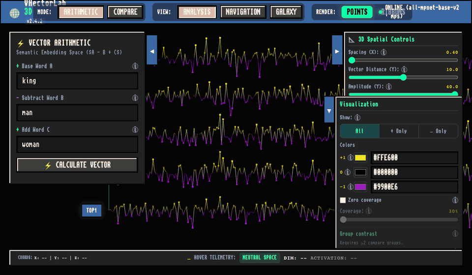

# VHectorLab 3D

**A local study / laboratory tool for exploring semantic embeddings in 3D (WebGL). Not a production SaaS.**



3D visualization (WebGL/Three.js) and semantic embedding vector arithmetic (`A − B + C`), plus compare sequences and related lab experiments.

| | |
| :--- | :--- |
| **License** | [Apache-2.0](./LICENSE) © 2026 Hector Bauzan |
| **Public demo** | [Hugging Face Space](https://huggingface.co/spaces/hbauzan/llm-semantic-visualizer) |
| **Local (macOS)** | `./setup.sh` → option `1` → http://127.0.0.1:5173 |

---

## Public demo (no install)

Try the hosted **cpu-basic** demo:

👉 **https://huggingface.co/spaces/hbauzan/llm-semantic-visualizer**

That Space is a shared study sandbox (Docker, CPU). Expect cold starts, variable latency, and soft resource limits. There is **no SLA**, no multi-tenant isolation, and no auth — please be gentle (avoid automated flooding of `/embed`, `/compare`, `/arithmetic`).

For serious work or heavier SAE/training experiments, run **locally** on macOS (below).

---

## Platform support

**Created and tested on macOS 26.5.1 (Darwin 25.5.0, Apple Silicon).**

This project was **not** prepared or validated for Windows or Linux. It may work there with a few adjustments (package managers, paths, process control), but that is unsupported. Prefer a Mac matching the versions above.

The Hugging Face Space image runs on Linux CPU inside HF’s Docker runtime — that path is supported for the **demo**, not as a general Linux desktop install guide.

---

## Quick start (recommended)

Everything goes through `./setup.sh`. On macOS, **option 1 installs missing tools for you** when needed.

```bash
# 1. Clone the repo (folder name matches the GitHub repo)
git clone https://github.com/hbauzan/vhectorlab.git
cd vhectorlab

# 2. Open the control panel
chmod +x setup.sh   # first time only, if needed
./setup.sh
```

Choose **option `1`** (`Deploy / Start Tool`).

That option will:

1. Probe backend (`:8000`) and frontend (`:5173`): matching process **and** health check
2. **If both healthy**: skip install/sync, tests, and start; open the browser
3. **If either is sick** (port/process/health mismatch, e.g. frozen Vite): recycle both (stop + start after tests)
4. **If only one is healthy**: restart **both** services after prereqs + tests
5. **If both down**: check/install prerequisites on macOS (`uv`, Homebrew+Node if needed, `.env`, `uv sync`, `npm install` if needed), ensure vocab, run tests, start both, open browser
6. After a fresh start: stream live backend logs (`Ctrl+C` pauses the tail — services stay up)

App URL when ready:

👉 **http://127.0.0.1:5173** (VHectorLab 3D — Magic Workbench chrome)

- Pause live logs: `Ctrl+C` → **Enter** returns to the menu; **Ctrl+C** again exits the panel (services keep running)
- Stop services: option **`10`** only (Ctrl+C never stops the stack)

> First run can take a while: it may download Homebrew/Node/`uv`, Python packages, and the embedding model.
> Re-running option **1** while the stack is already healthy will **not** bounce the servers or re-run tests.

---

## What `setup.sh` expects (and installs on Mac)

| Tool | Role | If missing on macOS |
| :--- | :--- | :--- |
| **uv** | Python deps / run backend | Installed via [official uv installer](https://docs.astral.sh/uv/) |
| **Node.js + npm** | Frontend (Vite / Vitest) | Installed via Homebrew (`brew install node`) |
| **Homebrew** | Used only to install Node if needed | Installed from [brew.sh](https://brew.sh) |
| **`.env`** | Runtime config | Copied from `.env.example` |
| **Backend deps** | FastAPI / PyTorch stack | `uv sync --extra dev` in `backend/` |
| **Frontend deps** | Three.js / Vite | `npm install` when `node_modules` is absent |
| **Docker Desktop** | **Optional** — only for option **7** (HF Spaces image build) | Not installed by option 1. Option 7 checks Docker; on macOS it can install the Docker Desktop cask via Homebrew and asks you to start the app |

**Daily local use (option 1) does not need Docker Desktop** — only `uv` + Node/`npm` (+ network).

You do **not** need to install `uv` or Node by hand on a typical Mac — option 1 handles that. You *do* need network access and (for Homebrew) permission to install software.

### Optional: Docker Desktop (option 7)

Install [Docker Desktop for Mac](https://www.docker.com/products/docker-desktop/) if you want to build the Hugging Face Spaces image locally. After install, open Docker Desktop and wait until the engine is running (whale icon steady), then use option **7**.

Option **8** creates/publishes a **Docker** Space on **cpu-basic** via the `hf` CLI + `git push` (Hub builds the image). It does **not** require Docker Desktop locally.

---

## `setup.sh` menu

| Option | What it does |
| :--- | :--- |
| **1** | Deploy/start: **idempotent** — if both healthy, only open browser; else prereqs→tests→start (**no Docker**) |
| **2** | Backend only (`:8000`) — **skip if already healthy**; refuse if sick |
| **3** | System heartbeat / health check |
| **4** | Frontend unit tests (Vitest) |
| **5** | Backend unit tests (pytest) |
| **6** | Vocabulary: load a custom file or generate N words |
| **7** | Build HF Spaces Docker image locally (torch CPU · optional :7860 smoke) |
| **8** | Create/publish HF Space (`sdk: docker`, cpu-basic) via `hf` + git push |
| **9** | View backend logs |
| **10** | **Stop** / clean services (always kills; not idempotent) |
| **0** | Exit |

---

## Environment variables

Copy `.env.example` → `.env` (option 1 does this if `.env` is missing). Common keys:

| Variable | Default | Description |
| :--- | :--- | :--- |
| `HOST` / `PORT` | `127.0.0.1` / `8000` | Backend listen address |
| `MODEL_NAME` | `all-mpnet-base-v2` | Embedding model |
| `VOCAB_PATH` | `public/vocab.txt` | App vocabulary file (use `public/vocab_en_es.txt` for EN∪ES) |
| `VITE_API_BASE_URL` | `/api` | Browser API base URL |
| `VITE_SHOW_CAM_POSE` | `false` | Live camera POS/ROT overlay (debug) |
| `VITE_AMIGA_PEN_0`…`_7` | MagicWB pens | Workbench theme palette pens (`#RRGGBB`) |
| `VITE_AMIGA_BG` / `_FG` / `_ACCENT` | `#222222` / `#F0F0F0` / `#3B67A2` | Page/panel bg, text, titlebar accent |

### EN + ES vocabulary

Default `public/vocab.txt` is English-only. For multilingual Arithmetic/Compare neighbors:

```bash
uv run python scripts/merge_vocab_en_es.py
# → public/vocab_en_es.txt (~10k EN ∪ ES seed; includes king/rey … cat/gato)
```

Set `VOCAB_PATH=public/vocab_en_es.txt`, then regenerate embeddings (`scripts/precompute_vocab_embeddings.py` or upcoming setup option 11). Languages beyond EN+ES are out of scope for now.

---

## Manual start (without the panel)

Only if you prefer not to use `setup.sh` (still assumes macOS + tools already available):

```bash
# Backend
cd backend
uv sync --extra dev
uv run python -m server

# Frontend (another terminal, repo root)
npm install
npx vite --port 5173 --host 127.0.0.1
```

---

## Troubleshooting

| Symptom | What to check |
| :--- | :--- |
| Unsupported platform warning | You are not on Darwin/macOS — unsupported; adapt paths/package managers yourself |
| Homebrew install asks for a password | Normal on first install; approve locally |
| `uv` / `npm` still missing after option 1 | Open a **new** terminal (PATH refresh), then re-run `./setup.sh` |
| Backend tests slow / fail on first run | Model download needs network; wait and retry |
| Browser does not open | Open http://127.0.0.1:5173 manually |
| Port already in use / option 1 says **sick** | Option 1 now recycles automatically. Or use option `10`, then start again |
| Option 1 restarts everything every time | It should not when both are healthy — report a bug if it still kills/relaunches a healthy stack |
| Option 7 fails / “Docker daemon not running” | Install/open **Docker Desktop**, wait until it is running, retry option 7 |
| `Failed to spawn: pytest` / No such file | Stale `backend/.venv` after renaming the folder. Option 1 now recreates it; or run `rm -rf backend/.venv && cd backend && uv sync --extra dev` |

---

## License

Apache License 2.0 — see [LICENSE](./LICENSE) and [NOTICE](./NOTICE).
