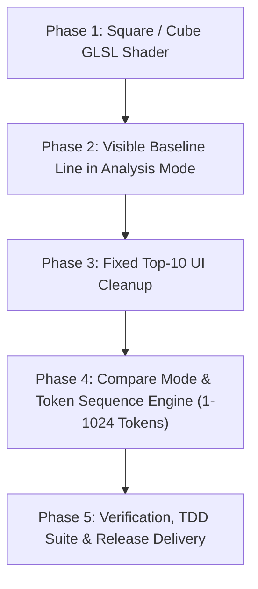

> **ARCHIVO HISTÓRICO** — archivado 2026-08-02.
> **Estado al archivar:** release **1.0.0** mergeado a `main`; el producto avanzó luego a **1.5.0** (epic mobile/mesh/ribbons).
> **Ramas / merges de la ventana 1.0.0 (selección):**
> - `feat/compare-cosine-vs-anchor`
> - `feat/compare-cosine-sort-arrows`
> - `fix/default-navigation-camera` / `fix/sidebar-top10-no-scroll`
> - merges `merge(compare): …` en `main`
>
> Checklist de release 1.0.0; versiones posteriores ver `CHANGELOG.md`.

# 🗺️ VectorLab 3D — Version 1.0.0 Release Roadmap

> **Target Audience & Agent Role:** This document serves as a complete, self-contained technical blueprint for an AI engineer or subagent building VectorLab 3D version 1.0.0 from scratch. It contains all architectural invariants, GPU shader specs, UI design tokens, layout math formulas, and step-by-step implementation phases.

---

## 🎯 1. Architectural & Engineering Invariants (Mandatory)

Any agent implementing or extending VectorLab 3D **MUST** strictly enforce the following repository invariants:

### 1.1. WebGL & GPU Shader Rules (Three.js)
1. **Frustum Culling Disabled (`frustumCulled = false`)**:
   All `THREE.Points` and `THREE.Line` meshes MUST set `frustumCulled = false`. In-situ buffer modifications (`Float32Array` positional updates) without updating bounding spheres can cause GPU meshes to pop or disappear when camera angle shifts.
2. **Depth Write & Transparency (`depthWrite = false`, `transparent: true`)**:
   Point cloud materials with dynamic opacity MUST disable depth buffer writing:
   ```javascript
   transparent: true,
   depthWrite: false,
   blending: THREE.NormalBlending
   ```
3. **Divergent Activation Ramps (No Red / No Green)**:
   - **Positive Range ($0 \rightarrow +1$)**: Black (`vec3(0.0)`) $\rightarrow$ Orange (`#FF8000` / `vec3(1.0, 0.5, 0.0)`) $\rightarrow$ Incandescent Yellow (`#FFE600` / `vec3(1.0, 0.95, 0.0)`).
   - **Negative Range ($0 \rightarrow -1$)**: Black (`vec3(0.0)`) $\rightarrow$ Electric Blue (`#0040FF` / `vec3(0.0, 0.25, 1.0)`) $\rightarrow$ Neon Violet (`#9900E6` / `vec3(0.6, 0.0, 0.9)`).
4. **Fast-Path Zero Activation Optimization ($|t| < 0.01$)**:
   In GLSL Fragment Shader, if absolute activation intensity $|t| < 0.01$, perform an early return with minimal opacity ($\alpha \approx 0.05$) to bypass expensive color interpolation:
   ```glsl
   if (absT < 0.01) {
       gl_FragColor = vec4(vec3(0.0), 0.05 * baseOpacity * solidEdge);
       return;
   }
   ```
5. **Z-Score + Tanh Normalization**:
   Raw embedding activations $v_i \in [-0.15, +0.15]$ MUST be standardized across the dataset mean $\mu$ and std $\sigma$ using symmetric sigmoidal compression:
   ```javascript
   export function calculateZScoreNormalized(values, scaleFactor = 1.2) {
     const mean = values.reduce((a, b) => a + b, 0) / values.length;
     const std = Math.sqrt(values.reduce((sq, n) => sq + Math.pow(n - mean, 2), 0) / values.length) || 1.0;
     return values.map(v => Math.tanh(scaleFactor * ((v - mean) / (std + 1e-9))));
   }
   ```

### 1.2. Navigation & Controls (WASDQE)
1. **Bounded Speed Inertia (`lerp`)**:
   Camera navigation MUST use linear velocity interpolation (`this.velocity.lerp(moveVector, 0.25)`) to prevent exponential acceleration build-up.
2. **UI Form Isolation**:
   Keyboard events (`KeyW`, `KeyA`, `KeyS`, `KeyD`) MUST be ignored when active DOM element is an `INPUT`, `TEXTAREA`, or `SELECT`.

---

## 🚀 2. Key New Feature Requirements for Version 1.0.0

### Feature A: Square / Cube Point Shader Rendering
- Replace spherical disc discard (`length(gl_PointCoord - 0.5) > 0.5`) in `src/visualizer/DivergentShading.js` with crisp, axis-aligned square/cube points.
- Compute sharp 1-pixel anti-aliased square bounding edges using box distance:
  ```glsl
  vec2 coord = abs(gl_PointCoord - vec2(0.5));
  float maxDist = max(coord.x, coord.y);
  float solidEdge = 1.0 - smoothstep(0.44, 0.49, maxDist);
  ```

### Feature B: Visible Origin Baseline in Analysis Mode
- Render a vertical reference line at the 3D thread origin ($X = \text{startX}$) connecting all 5 thread start points (`WORD_A`, `WORD_B`, `WORD_C`, `RES`, `TOP_1`).
- Provides a clean visual baseline anchor connecting floating Glassmorphic badges to the WebGL 3D scene.

### Feature C: Fixed Top-10 UI Space Optimization
- Remove the `<select id="top-k">` dropdown element from `src/ui/Sidebar.js`.
- Lock `top_k` parameter to `10` across all API calls and backend logic.
- Reclaim vertical sidebar space so the nearest cosine results list occupies maximum visible height.

### Feature D: Dual Workspace Mode Selector (`MODE: [ ARITHMETIC | COMPARE ]`)
- Add a top Navbar mode toggle: `MODE: [ ARITHMETIC | COMPARE ]`.
- **ARITHMETIC Mode**: The active 3D vector arithmetic engine ($A - B + C$, returning components, result, and top-1 vector across 5 stacked threads).
- **COMPARE Mode**: A new multi-sequence text/token comparison view:
  - Supports loading and displaying custom word/token sequences from **1 to 1024 tokens**.
  - Renders token sequences side-by-side or stacked in 3D WebGL space.
  - Allows adjusting 3D spatial parameters (`Separación X`, `Distancia Vectores Y`, `Amplitud Y`, `Longitud Z`, `Grosor Puntos`) in real time.

---

## 🛠️ 3. Phased Implementation Roadmap for AI Agent Execution



---

### 📦 Phase 1: Square / Cube GLSL Shader Implementation
**Goal:** Transition point cloud visualization from round discs to sharp 3D square/cube points.

#### Tasks:
1. **Modify `src/visualizer/DivergentShading.js`**:
   - Update `divergentFragmentShader` to compute square box distance `max(abs(coord.x), abs(coord.y))`.
   - Remove circular `length(coord) > 0.5` discard.
   - Maintain anti-aliased edge smoothing (`smoothstep(0.44, 0.49, maxDist)`).
2. **Update Unit Tests**:
   - Update `tests/DivergentShading.test.js` to verify square point shader logic and ramp boundaries.

---

### 📦 Phase 2: Visible Baseline Line in Analysis Mode
**Goal:** Anchor all thread origins with a visible vertical baseline in Analysis Mode.

#### Tasks:
1. **Modify `src/visualizer/Instancer.js` & `MeshFactory.js`**:
   - Create a vertical reference line geometry connecting the 3D origins of all stacked threads at $X = \text{startX}$.
   - Add the vertical baseline mesh to `this.activeGroup` when `viewMode === "ANALYSIS"`.
2. **Styling & Alignment**:
   - Ensure the line is drawn with a subtle cyan/gold glass opacity (`opacity: 0.6`, `transparent: true`).

---

### 📦 Phase 3: Fixed Top-10 UI Space Optimization
**Goal:** Simplify sidebar UI by removing Top-K selection and fixing output to 10 results.

#### Tasks:
1. **Modify `src/ui/Sidebar.js`**:
   - Remove `<div class="input-group">` containing Top-K `<select>` element.
   - Hardcode `topK = 10` in form submission handler.
2. **Modify `src/style.css`**:
   - Adjust `.results-list` container `max-height` to utilize reclaimed vertical space.
3. **Update Core Calls**:
   - Update `src/main.js` to always pass `10` as `top_k`.

---

### 📦 Phase 4: Compare Mode & Sequence Engine (1 to 1024 Tokens)
**Goal:** Introduce `COMPARE` mode in Navbar to visualize custom text/token sequences of 1–1024 items.

#### Tasks:
1. **Backend Endpoint (`backend/routers/core.py` & `state.py`)**:
   - Add `/compare` endpoint accepting a list of texts/tokens `["text1", "text2", ...]` up to 1024 items.
   - Return batch embeddings and normalized activation arrays.
2. **Navbar UI Toggle (`src/ui/Navbar.js` & `src/style.css`)**:
   - Add `MODE: [ ARITHMETIC | COMPARE ]` selector buttons in Navbar.
   - Handle mode switching event callbacks.
3. **Compare Sidebar Panel (`src/ui/ComparePanel.js`)**:
   - Create input UI allowing users to paste or upload token text sequences (1–1024 items).
   - Add controls for loading sample token lists.
4. **Visualizer Engine (`src/visualizer/LayoutEngine.js` & `Instancer.js`)**:
   - Support sequence layout mapping for up to 1024 token threads.
   - Enable spatial sliders (`Separación X`, `Distancia Vectores Y`, `Amplitud Y`, `Longitud Z`, `Grosor Puntos`) for Compare Mode.

---

### 📦 Phase 5: Verification, TDD Suite & Release Delivery
**Goal:** Self-verify implementation, update test suites, and execute dev-protocol Git delivery.

#### Tasks:
1. **Unit Testing (`tests/CompareMode.test.js`, `tests/DivergentShading.test.js`)**:
   - Run `npm test` and ensure 100% green unit test pass.
2. **Documentation Sync**:
   - Record architectural changes in `CHANGELOG.md` under version `[1.0.0]`.
   - Update `.agents/skills/dev-protocol/lessons-learned.md`.
3. **Git Delivery Gate**:
   - Present summary at Approval Gate before final merge to `main`.

---

## 📊 Matrix of File Changes for Version 1.0.0

| File | Purpose / Change Required |
| :--- | :--- |
| [`src/visualizer/DivergentShading.js`](file:///Users/hbauzan/treepwood/lsv2/src/visualizer/DivergentShading.js) | Square/cube GLSL fragment shader implementation |
| [`src/visualizer/Instancer.js`](file:///Users/hbauzan/treepwood/lsv2/src/visualizer/Instancer.js) | Vertical baseline origin line in Analysis mode & 1024 token sequence rendering |
| [`src/ui/Sidebar.js`](file:///Users/hbauzan/treepwood/lsv2/src/ui/Sidebar.js) | Remove Top-K dropdown, fix Top-10 results |
| [`src/ui/Navbar.js`](file:///Users/hbauzan/treepwood/lsv2/src/ui/Navbar.js) | Add `MODE: [ ARITHMETIC \| COMPARE ]` selector |
| [`src/ui/ComparePanel.js`](file:///Users/hbauzan/treepwood/lsv2/src/ui/ComparePanel.js) | **[NEW]** Input UI for token sequences (1–1024 tokens) |
| [`backend/routers/core.py`](file:///Users/hbauzan/treepwood/lsv2/backend/routers/core.py) | Add `/compare` batch embedding endpoint for 1-1024 tokens |
| [`tests/CompareMode.test.js`](file:///Users/hbauzan/treepwood/lsv2/tests/CompareMode.test.js) | **[NEW]** Unit tests for Compare Mode layout and API parsing |
