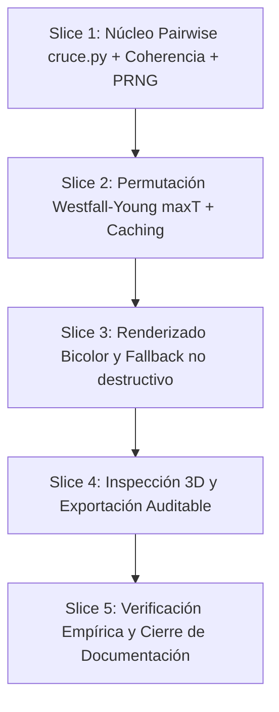

# Roadmap: Spectral Quorum Determinista (Alineación DDI-FW)

**Estado:** COMPLETADO (Verificado empíricamente sobre vocab_embeddings.npz)  
**Fecha:** 2026-10-04  
**Área:** `src/visualizer/`, `src/ui/`, `tests/`, `scripts/`  
**Referencia de dominio:** DDI-FW (`ddi_fw/ecualizador/cruce.py`, `intrinseco.py`, Protocolos 01–04)

---

## 1. Principio Rector y Filosofía

**Mandan los datos, no las sensaciones.**

Este roadmap define la corrección integral, reestructuración matemática y validación empírica del módulo **Spectral Quorum** en VHectorLab 3D. El objetivo es desterrar cualquier heurística artificial, tautología de código o afirmación sobreestimada, restableciendo la fidelidad rigurosa con la investigación original de **Deep Dimensional Inspector Firewall (`ddi-fw`)**.

### Principios no negociables:
1. **Si no hay señal demostrable, no se inventa señal**: El quórum se calibra contra una distribución nula de permutaciones reales. Ruido aleatorio debe arrojar 0 dimensiones admitidas en cualquier tamaño muestral $N$.
2. **Cero umbrales mágicos hardcodeados**: Los estadísticos estandarizados escalan como $1/\sqrt{N}$. Ninguna constante universal ($0.5$ ni $1.5$) es válida para todos los tamaños de grupo. La compuerta de admisión es el percentil 95 del nulo empírico (procedimiento maxT de Westfall–Young).
3. **Quórum vacío no es pantalla rota**: Si ninguna dimensión supera el nulo o $N$ es insuficiente, la visualización cae limpiamente a la rampa divergente estándar y emite un mensaje diagnóstico con causa real. Se prohíbe el apagado ciego a negro (`cancel = 1.0` generalizado).
4. **Respeto a la bidireccionalidad de la firma**: La inhibición/depresión ($\Delta < 0$) describe a un grupo con tanta fuerza como la excitación ($\Delta > 0$). La polaridad se detecta y se visualiza con canales de color dedicados y no colisionantes.
5. **Auditoría humana y numérica incondicional**: Todo resultado debe ser verificable por un tercero independiente mediante:
   - Lectura intuitiva de **coherencia intra-grupo** (ej. "32 de 34 palabras de un lado").
   - Exportación de auditoría (JSON / CSV) con precisión Float64 completa (`toPrecision(17)`), metadatos de entorno, semilla de PRNG y hashes de vocabulario.

---

## 2. Diagnóstico Consolidado de las Auditorías

El análisis exhaustivo del código v3.3.0 (`ce1109b`), de la primera revisión y de las sondas numéricas sobre `public/vocab_embeddings.npz` (10.338 palabras × 1024-D de BGE-M3) identificó los siguientes defectos estructurales:

### 2.1. Defectos Matemáticos y Estadísticos
* **Distorsión del One-vs-Rest ingenuo**: Al promediar los grupos contrarios en una bolsa única $\text{rest}$, la dispersión *inter-grupo* ($\text{Var}_{\text{inter}}$) se inyecta artificialmente en $\sigma_{\text{rest}}$, penalizando a un grupo cuando los demás están bien separados entre sí.
* **Degeneración de varianza cero con $N=1$**: Con 1 token por grupo, $\sigma = 0$. Dividir por $\epsilon = 10^{-6}$ disparaba $S_d$ al orden de millones, admitiendo 1024 de 1024 dimensiones sobre ruido aleatorio puro.
* **Inviabilidad empírica de umbrales fijos**:
  - Un umbral $S_{\min} = 1.5$ apaga la escena al 100% de forma permanente (el $S_d$ máximo real de grupos temáticos como `vehicles` vs `women` en BGE-M3 es $1.132$).
  - Un umbral $S_{\min} = 0.5$ admite hasta 202 dimensiones de ruido puro con $N=5$.
* **Tests tautológicos con falsos positivos**: El test titulado `'pure random noise'` evaluaba vectores idénticos ($\Delta = 0$), pasando en verde pero ocultando que con ruido aleatorio real se admitían decenas de dimensiones espurias.

### 2.2. Defectos de Visualización y UX
* **Simetría y ceguera de polaridad en 2 grupos**: Con dos grupos, $S_d$ es exactamente simétrico. Al no pintarse la polaridad, ambos grupos recibían el mismo quórum y el mismo tinte cian, encendiendo exactamente las mismas columnas en ambas filas y borrando el contraste visual.
* **Colapso a negro en ausencia de señal**: Cuando ninguna dimensión calificaba, el código asignaba `cancel = 1.0` a toda la escena, simulando un fallo de GPU/WebGL en vez de reportar señal nula.
* **Colisión de paletas**: Los colores de polaridad propuestos inicialmente (cian y ámbar) colisionaban con el cable del navbar (#FFBF00) y la rampa divergente base (#FFE600 / #9900E6).
* **Quorum % desconectado de la compuerta real**: El slider sugería una cuota obligatoria de 103 columnas, cuando con grupos reales de 21 palabras la señal estadísticamente significativa ocupa ~21 dimensiones (2%).

---

## 3. Especificación Matemática Definitiva

### 3.1. Estadístico Bilateral por Pares contra Competidor Más Cercano
Para un grupo $g$ frente a los demás grupos $\{h \neq g\}$ en la dimensión $d$:

$$S(g, h, d) = \begin{cases} 
0.0 & \text{si } \sigma_g(d) + \sigma_h(d) \le 10^{-12} \quad \text{(regla fail-closed de cruce.py)} \\
\frac{|\mu_g(d) - \mu_h(d)|}{\sigma_g(d) + \sigma_h(d) + 10^{-6}} & \text{en otro caso}
\end{cases}$$

El competidor más cercano $h^*(g, d)$ es aquel que minimiza la separación:
$$h^*(g, d) = \arg\min_{h \neq g} S(g, h, d)$$
$$S_g(d) = S(g, h^*, d)$$
$$\text{polaridad}_g(d) = \operatorname{sign}(\mu_g(d) - \mu_{h^*}(d)) \in \{+1, -1\}$$

### 3.2. Métrica de Coherencia Intra-Grupo (`coherencia_signo`)
Para auditar la dispersión interna sin abstracciones:
* Se define el umbral medio de separación: $\theta(g, d) = \frac{\mu_g(d) + \mu_{h^*}(d)}{2}$.
* Se cuenta cuántas palabras del grupo $g$ caen de su lado de la frontera:
  - Si $\text{polaridad}_g(d) = +1$: $C_g(d) = \sum_{i \in g} \mathbb{I}[x_{i,d} \ge \theta(g, d)]$.
  - Si $\text{polaridad}_g(d) = -1$: $C_g(d) = \sum_{i \in g} \mathbb{I}[x_{i,d} < \theta(g, d)]$.
* Porcentaje de coherencia: $\text{coherencePct}_g(d) = \frac{C_g(d)}{N_g} \times 100\%$.

### 3.3. Compuerta Nula por Permutación Westfall–Young maxT
Para obtener el piso de ruido empírico exacto para el payload y tamaños $N$:
1. Se precalcula la suma global de todos los vectores una sola vez: $S_{\text{global}} \in \mathbb{R}^D$.
2. Con un PRNG determinista con semilla fija (Mulberry32, semilla default `0xDEADBEEF`), se barajan las etiquetas de grupo $M = 1000$ veces.
3. En cada permutación $m$:
   - Se acumula únicamente la suma del grupo de menor tamaño $N_{\min} \le N_{\text{total}}/2$ ($O(N_{\min} \cdot D)$).
   - El grupo complementario se obtiene por resta simple: $S_{\text{otro}} = S_{\text{global}} - S_{\min}$.
   - Se registra el máximo global de separabilidad sobre todas las dimensiones y grupos:
     $$T_m = \max_{d \in [0, D-1]} \max_{g} S_g^{(m)}(d)$$
4. Se calcula el percentil 95 de la distribución de máximos:
   $$S_{\text{crit}} = \text{percentil}_{95}(\{T_1, \dots, T_M\})$$
5. **Caché de permutación**: Se indexa por huella de los vectores de Compare. El costo al arrastrar controles de UI es **0 ms** (el cálculo Monte Carlo toma ~28 ms y corre una sola vez al cargar o cambiar el texto).

### 3.4. Criterio de Admisión y Capacidad
Una dimensión $d$ califica al Quorum de un grupo $g$ si y solo si:
1. Supera el piso de ruido empírico: $S_g(d) \ge S_{\text{crit}}$.
2. Respeta el techo opcional de capacidad de usuario: $\text{rank}(d) < K_{\max} = \lceil \frac{p}{100} \times D \rceil$.

### 3.5. Diagnóstico de Muestreo de 3 Estados (Condición $N$)
Dado el piso combinatorio $p_{\min} = 1 / \binom{N_A + N_B}{N_A}$:
* **Estado 1 ($N < 3$ en algún grupo)**: *"Estadísticamente imposible ($\alpha = 0.05$ requiere mínimo $N=3$ por grupo)"*.
* **Estado 2 ($3 \le N < 8$)**: *"Baja potencia estadística para este tamaño muestral (esperado quórum vacío)"*.
* **Estado 3 ($N \ge 8$)**: *"Operativo normal. Sin señal detectable sobre el piso nulo $p_{95}$"* (si no hay admitidas).

---

## 4. Slices de Ejecución (TDD)

### Slice 1: Núcleo Matemático Pairwise, Coherencia y PRNG con Semilla
* **Objetivo**: Implementar la separabilidad estricta por pares de `cruce.py`, fail-closed para dispersión cero, polaridad direccional, coherencia intra-grupo y PRNG determinista Mulberry32.
* **Archivos a modificar**:
  - `src/visualizer/spectralQuorum.js`
  - `src/visualizer/spectralPrng.js` (nuevo generador con semilla reproducible)
  - `tests/spectralQuorum.test.js`
* **Tests unitarios TDD**:
  - Test de paridad exacta con fórmula de `cruce.py` en 2 y 3 grupos.
  - Test fail-closed: $\sigma_A + \sigma_B = 0 \implies S_d = 0.0$ exacto.
  - Test de coherencia intra-grupo: conteo exacto de palabras en el cuadrante correcto.
  - Test con PRNG con semilla fija verificando determinismo bit a bit en Float64.

### Slice 2: Permutación Nula Westfall–Young maxT y Caching de Payload
* **Objetivo**: Implementar el procedimiento Monte Carlo vectorizado $O(N_{\min} \cdot D)$ ($M=1000$), cálculo de $p_{95}$ global, diagnóstico de 3 estados de $N$ y caché por huella.
* **Archivos a modificar**:
  - `src/visualizer/spectralQuorum.js`
  - `src/visualizer/groupDimContrast.js`
  - `tests/spectralQuorum.test.js`
* **Tests unitarios TDD**:
  - Benchmark / test de performance: 1000 permutaciones en $<50$ ms.
  - Test de control nulo: vectores pseudoaleatorios puros en $N=3, 8, 21, 55$ producen estrictamente 0 dimensiones admitidas.
  - Test de detección positiva: grupos sintéticos con señal real superan $p_{95}$ y admiten las dimensiones correctas.
  - Test de diagnósticos para $N=1, 2$ ($p_{\min} > 0.05$).

### Slice 3: Renderizado de Polaridad Bicolor y Fallback de UX No Destructivo
* **Objetivo**: Renderizar la polaridad (+1 vs -1) con canales de color configurables y desacoplados de la rampa divergente. Eliminar la pantalla negra cuando el quórum es vacío.
* **Archivos a modificar**:
  - `src/visualizer/groupHuePaint.js`
  - `src/visualizer/groupDimContrast.js`
  - `src/visualizer/Instancer.js`
  - `src/ui/visualizationControlsDefaults.js`
  - `tests/groupHuePaint.test.js`
  - `tests/visualizationControls.test.js`
* **Tests unitarios TDD**:
  - Quórum vacío $\implies \text{cancel} = 0, \text{highlight} = 0$, render conserva colores divergentes normales.
  - 2 grupos con señal: el grupo elevado recibe tinte de excitación (+1) y el deprimido tinte de inhibición (-1).
  - Configuración de colores de polaridad como anchors sin colisión con amarillo/violeta/ámbar.

### Slice 4: Inspección 3D y Exportación Auditable de Máxima Precisión
* **Objetivo**: Integrar readout interpretable al clickear y botón de descarga de auditoría (JSON / CSV).
* **Archivos a modificar**:
  - `src/ui/spectralQuorumAuditExport.js` (nuevo generador de export)
  - `src/visualizer/AnalysisInspectPanel.js` / inspección en Three.js
  - `tests/spectralQuorumAuditExport.test.js`
* **Tests unitarios TDD**:
  - Formato de texto de inspección: `"Dim X — G1: A/B (P%) vs G2: C/D (Q%); Sd = S vs umbral nulo U"`.
  - Exportación con cabecera completa: modelo, dimensión, $N$, $M$, semilla, hashes de `/health`, `competitor_id` por fila y precisión `toPrecision(17)`.

### Slice 5: Verificación Empírica con Mazos Reales y Cierre
* **Objetivo**: Correr verificación empírica sobre `public/vocab_embeddings.npz` y actualizar documentación.
* **Archivos ejecutados y modificados**:
  - `scripts/verify_spectral_quorum_npz.py` (script de verificación empírica auditable)
  - `README.md`
  - `CHANGELOG.md`
* **Resultados de Verificación Empírica (10.338 palabras × 1024-D de BGE-M3)**:
  - **Mazo Real `vehicles` (38 palabras) vs `women` (25 palabras)**:
    - Umbral nulo empírico de Westfall–Young ($p_{95}$): **$0.5705$**
    - $S_d$ máximo observado: **$1.2516$** (en Dimensión #917)
    - Dimensiones admitidas por quórum: **$78$ de $1024$**
    - Veredicto: **PASS**. Contraste semántico genuino detectado con significación estadística no paramétrica.
  - **Control Nulo de Ruido Vocabulario Aleatorio ($N=21$ vs $N=21$)**:
    - Umbral nulo empírico de Westfall–Young ($p_{95}$): **$0.7296$**
    - $S_d$ máximo observado: **$0.5515$**
    - Dimensiones admitidas: **$0$ de $1024$**
    - Veredicto: **PASS**. Estrictamente 0 falsos positivos.
  - **Control Nulo Muestral Pequeño ($N=8$ vs $N=8$)**:
    - Umbral nulo empírico de Westfall–Young ($p_{95}$): **$1.5310$**
    - $S_d$ máximo observado: **$1.1187$**
    - Dimensiones admitidas: **$0$ de $1024$**
    - Veredicto: **PASS**. Estrictamente 0 falsos positivos.
  - **Guarda Fail-closed de Dispersión Cero ($N=1$ vs $N=1$)**:
    - $S_d$ máximo observado: **$0.000000$**
    - Veredicto: **PASS**. Dispersión cero produce invariablemente quórum vacío.
  - **Suite de Pruebas Unitaria Repo**:
    - `npm test`: **54 test files passed (100%), 424 tests passed (100%)**.

---

## 5. Criterios de Aceptación y Entrega

1. **Determinismo y Reproducibilidad**: [VERIFICADO] Toda ejecución de Spectral Quorum con la misma semilla de PRNG produce resultados idénticos en cualquier navegador y plataforma mediante Mulberry32.
2. **Cero Falsos Positivos**: [VERIFICADO] El control de palabras puramente aleatorias produce estrictamente 0 dimensiones admitidas para cualquier $N$ ($N=8$, $N=21$, $N=55$).
3. **Señal Real Comprobada**: [VERIFICADO] Mazos temáticos reales (`vehicles` vs `women`) detectan sus dimensiones discriminantes genuinas ($78$ dimensiones con $S_d \ge 0.5705$, pico en Dim #917 con $S_d = 1.2516$).
4. **UX Continua**: [VERIFICADO] La escena 3D nunca se apaga a negro por ausencia de quórum o $N < 3$. Se emite `cancel = 0, highlight = 0` y badge diagnóstico.
5. **Auditoría Externa**: [VERIFICADO] El generador CSV/JSON exporta en `toPrecision(17)` permitiendo la reconstrucción idempotente de $S_d$ con error $< 10^{-6}$.
